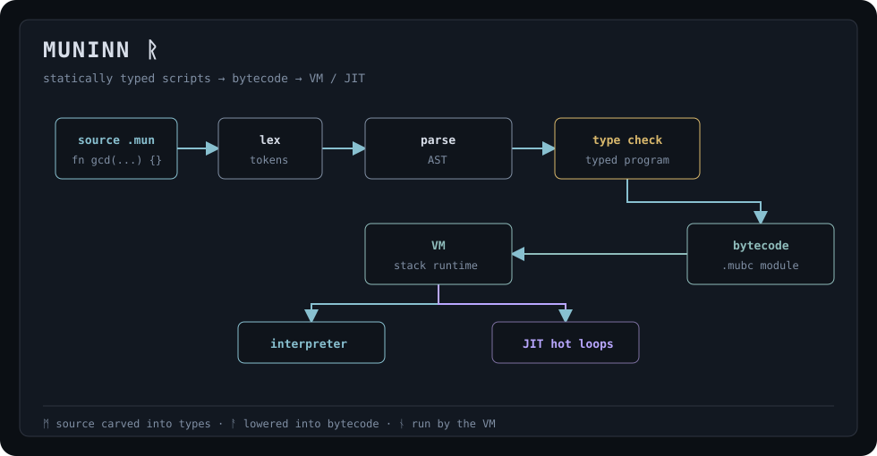
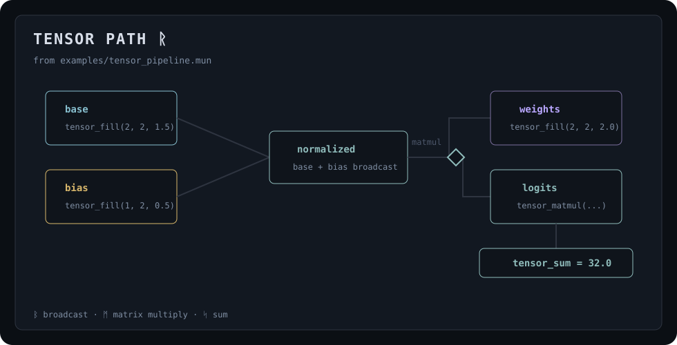
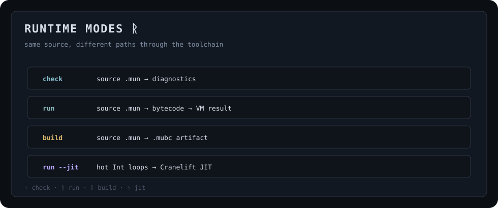
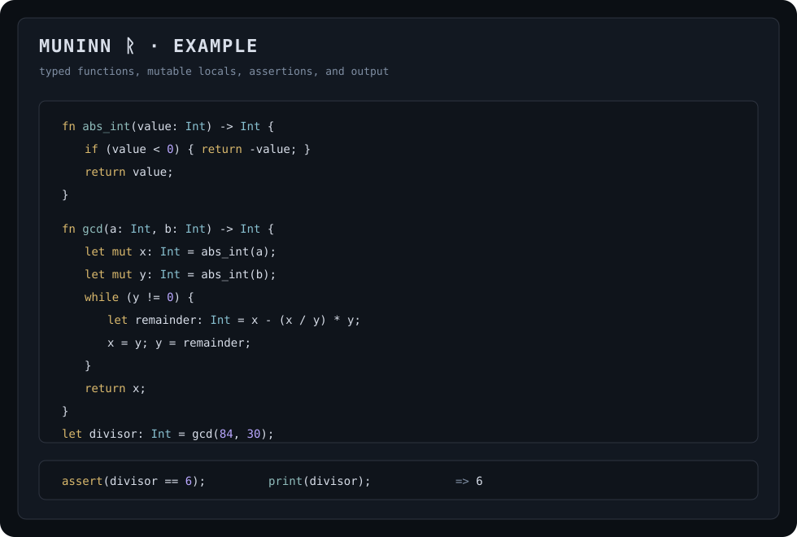

# Muninn 🐦‍⬛
<p>
  
  
  
  
</p>

Muninn is a small statically typed scripting language implemented in Rust.



## Features

### Language
- Primitive types: `Int`, `Float`, `Bool`, `String`, `Tensor`, and `Void`
- `let` bindings with optional local type inference, plus `mut` for mutable variables
- Functions with typed parameters and explicit return types
- Control flow with `if`, `while`, expression-valued blocks, and `if/else`
- Assignment, function calls, arithmetic, comparison, and logical operators
- String concatenation with `+`
- Tensor arithmetic with broadcasting and matrix multiplication

### Runtime
- Built-in functions for printing and assertions
- Tensor built-ins for creating, reshaping, multiplying, and reducing tensors

### Tooling
- Type-check source files
- Compile programs to `.mubc` bytecode
- Run source files or precompiled bytecode
- Hot reload with global preservation at VM safe points

### Performance
- Capacity reservation mode for allocation-free interpreter hot paths
- Optional tracing JIT for small hot `Int` loops, backed by Cranelift
- Inline global lookup cache with reload-safe invalidation

## Tensor path

Muninn has a small tensor runtime for typed numerical scripts.



For the compiler/runtime shape and current boundaries, see [Architecture](docs/architecture.md).

## Runtime modes

The same source can be checked, run directly, compiled to bytecode, or run with the experimental JIT.



## Benchmarks

| benchmark | what it measures |
|---|---|
| `scalar_loop` | compile + run scalar loop |
| `vm_only_scalar_loop_interpreter` | interpreter loop execution |
| `vm_only_scalar_loop_jit_cold` | JIT loop execution |
| `native_call` | tensor builtin call overhead |
| `tensor_elementwise` | tensor broadcasting and addition |
| `tensor_matmul` | matrix multiply builtin |

## Metrics

Generated by `cargo run --release --bin muninn-metrics`. Wall-clock numbers are local release-mode measurements.

<!-- metrics:start -->
| metric | value |
|---|---:|
| workspace tests | 88 |
| benchmark targets | 6 |
| example programs | 3 |
| `dsa_euclid.mun` source | 691 B |
| `dsa_euclid.mun` bytecode | 6.2 KB |
| `tensor_pipeline.mun` source | 367 B |
| `tensor_pipeline.mun` bytecode | 3.6 KB |
| `perceptron.mun` source | 204 B |
| `perceptron.mun` bytecode | 1.7 KB |
| scalar loop compile + run | 1421 µs/op |
| scalar loop VM only | 1522 µs/op |
| tensor pipeline compile + run | 101 µs/op |
<!-- metrics:end -->

## Example



<details>
  <summary>Copy the source</summary>

```muninn
fn abs_int(value: Int) -> Int {
    if (value < 0) {
        return -value;
    }
    return value;
}

fn gcd(a: Int, b: Int) -> Int {
    let mut x: Int = abs_int(a);
    let mut y: Int = abs_int(b);
    while (y != 0) {
        let quotient: Int = x / y;
        let remainder: Int = x - quotient * y;
        x = y;
        y = remainder;
    }
    return x;
}

fn lcm(a: Int, b: Int) -> Int {
    let divisor: Int = gcd(a, b);
    return (a / divisor) * b;
}

let divisor: Int = gcd(84, 30);
let multiple: Int = lcm(84, 30);
assert(divisor == 6);
assert(multiple == 420);
print(divisor);
print(multiple);
divisor;
```

</details>

<details>
  <summary> Commands</summary>

Run demo:

```bash
cargo run
```

Run a file:

```bash
cargo run -- run examples/dsa_euclid.mun
```

Run with the experimental JIT:

```bash
cargo run --features jit -- run --jit examples/dsa_euclid.mun
```

Lower the hot-loop threshold while experimenting:

```bash
cargo run --features jit -- run --jit --jit-threshold 1 examples/dsa_euclid.mun
```

Type-check a file:

```bash
cargo run -- check examples/dsa_euclid.mun
```

Compile a source file to bytecode:

```bash
cargo run -- build examples/dsa_euclid.mun -o examples/dsa_euclid.mubc
```

Run a precompiled bytecode artifact:

```bash
cargo run -- run-bc examples/dsa_euclid.mubc
```

Run tests:

```bash
cargo test --workspace
```

Run benchmarks:

```bash
cargo bench --bench runtime
```

Run benchmarks with JIT support compiled in:

```bash
cargo bench --features jit --bench runtime
```
